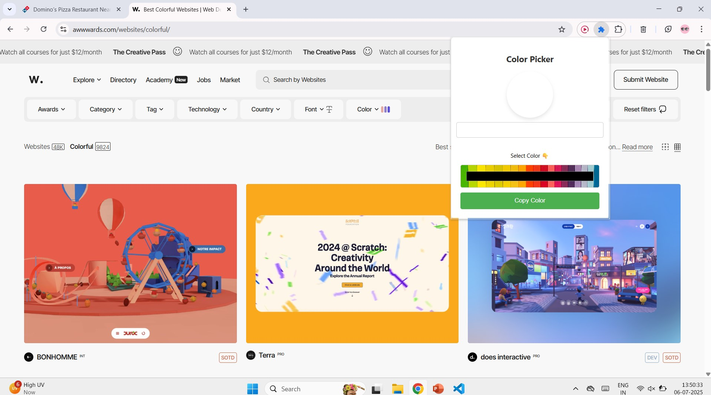

# color-picker-extension
Color Picker 
Overview

Cool Color Picker is a simple Chrome extension that allows users to pick a color and easily copy its value to the clipboard. This tool is especially useful for designers and developers who frequently need to use specific color values in their projects.

Features
    * Select a color using a color input.
    * Preview the selected color.
    * Copy the color value to the clipboard with a single click.

 ##View   
 
 
 
 
 

Installation
    1.Clone or download this repository:

    git clone https://github.com/Patil-Sanika/color-picker-extension

    2.Open Chrome and navigate to the Extensions page:

    Type chrome://extensions/ in the address bar and press Enter.

    3.Enable Developer Mode:

    Toggle the switch in the top right corner.

    4.Load the extension:

        * Click on the "Load unpacked" button.
        * Select the directory where you cloned or downloaded the repository.

Usage
    1.Open the extension:

        * Click on the Cool Color Picker icon in the Chrome toolbar.

    2.Select a color:

        * Use the color input to select your desired color.
        * The selected color will be previewed in the color box.

    3.Copy the color value:

        * Click the "Copy Color" button to copy the color value to the  clipboard.
        * An alert will notify you that the color has been copied.

File Structure
    - manifest.json - Contains the extension's metadata and permissions.
    - popup.html - The HTML file for the popup interface.
    - popup.css - The CSS file for styling the popup interface.
    - popup.js - The JavaScript file that handles the extension's       functionality.
    - icons/ - Directory containing the extension's icons.
